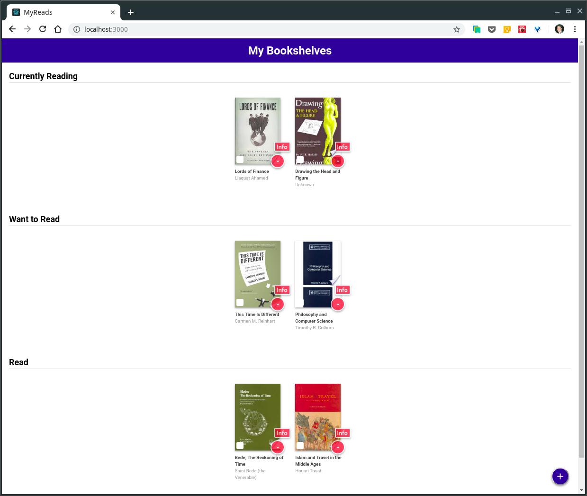
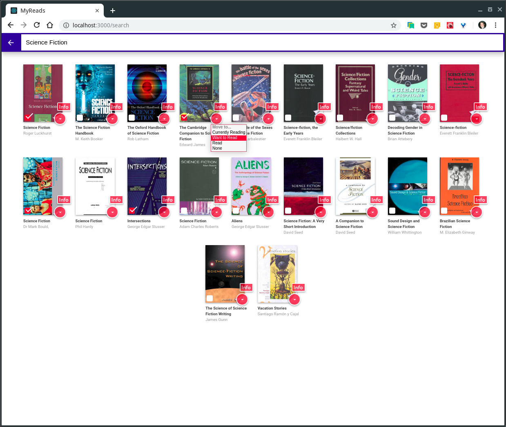
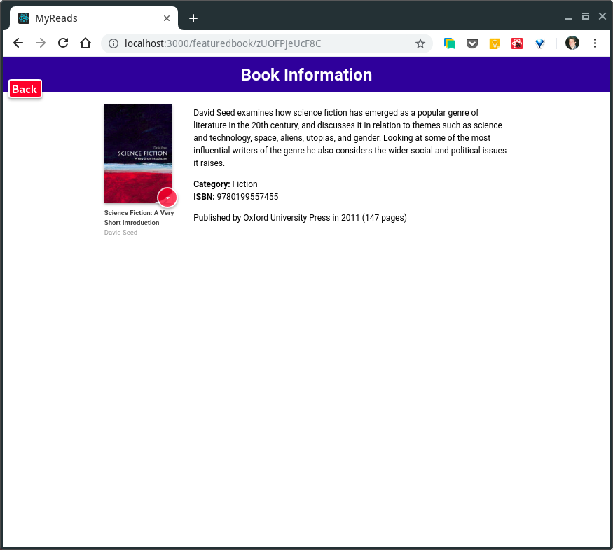

# MyReads Bookshelf App

This is a project for the Udacity Front-End Nanodegree. I was given the starter code and gradually added in my components and features. I went through the process of learning the extra bits and working out the udnerstanding that I needed as I went along. In the end, I had an app that was working, but seemed structured poorly and not quite reflecting the possibilities of React or my new understanding of it. But it did [work]().

I instead decided to erase that code and start again, with my new knowledge as a guide in my planning. The final app turned out great, and the functionality is exactly what I wanted.

### Description & Process

I decided to go with a 'Bookshelves' component, a 'Searchpage', and a 'Singlebook' component that supplied the actual books to both pages. I also decided to go beyond the requirements and add a 'Featuredbook' component and the ability to move more than one book at a time, on both the 'Bookshelves' and 'Searchpage'.

The state was managed by the main 'App' component, and passed down as props to all the child components. I also built methods on 'App' --- by declaring them using an ES6 arrow function format, I created a closure around the state variables. The result is that once I passed those methods down, I can call them anywhere and they will edit the state in the main app.

I also made use of the newer async/await structure for loading book data at various points as the logic of async/await seems SO much easier to grasp and take advantage of. I finished by styling the app in my favorite orande/blue-matieral-ish style (Go Illini!).

### Usage

The features of MyReads are pretty straightforward. The main page contains shelves that have books on them, and a link to a search page to find more books. To use the app:

#### Main/Start Page
1. click on the orange-down-arrow button on any book and choose the new shelf you'd like to move it to
2. the user may also check the box on any of the other books you see, and when you move any one of the check-marked books, they will all move to the same shelf
3. the user may even check a few books, and then assign a new shelf to an un-checked book, and both the checked books will move with it
4. click the blue plus-sign button in the lower right, and a search-page opens
5. click the info button to be taken to a page that will display detailed information about your book

#### Search Page
1. type in your search term, and the matching books will appear (if any of them are already on your shelf, that will be reflected in the shelf-changer button)
2. the user may assign the books to a new shelf, one-at-a-time or many-at-a-time, using the same procedure as on the main page
3. the info button will again, take the user to a page that will display detailed information about your book
4. clicking on the back arrow in the upper-left of the search page will take the user back to the main page

#### Book Information Page
1. title, author, and a book description will display here, if they are available
2. the user may assign the books to a new shelf using the same procedure as on the main page
3. clicking the back button in the upper left will return the user to the page she originally navigated from (if that page is the search-page, the search will automatically repopulate as soon as you go back to it, with your search term in the search bar; begin typing or deleting there to search again)

### Project Requirements

[See the rubric from Udacity](https://review.udacity.com/#!/rubrics/918/view)

### How to run MyReads locally

+ Clone this repository: `git clone https://github.com/zacharyPuthoff/reactnd-project-myreads-starter.git`
+ Install all project dependencies with `npm install`
+ Start the development server with `npm start`
+ Install the react-router-dom package; see [here](https://github.com/zacharyPuthoff/udacity07-react-bookshelves.git) for instructions
+ localhost:3000 should start up on it's own, if not, once your dev-server is running, just click [here](http://localhost:3000)

### BooksAPI Search Terms

The backend API uses a fixed set of cached search results and is limited to a particular set of search terms, which can be found in [SEARCH_TERMS.md](SEARCH_TERMS.md). That list of terms are the only terms that will work with the backend, so don't be surprised if your searches for Basket Weaving or Bubble Wrap don't come back with any results.

---

### How it all Looks

#### Bookshelves

#### Search results

#### Book Information

